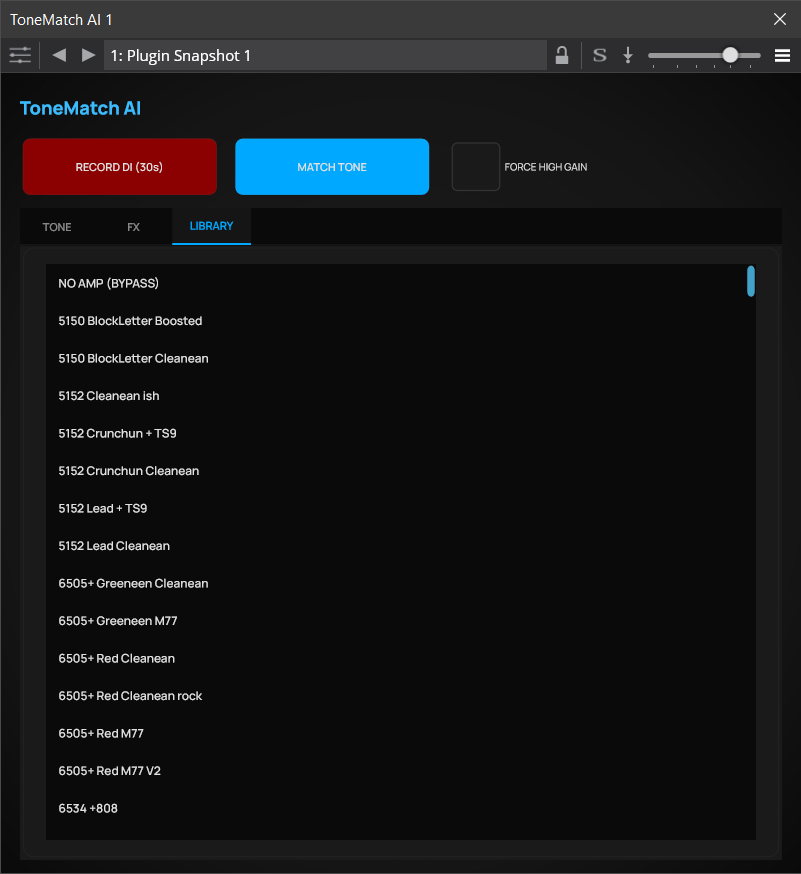

# 🎸 ToneMatch AI VST3

**AI-powered Guitar Tone Cloning Tool.**  
Плагин, который копирует звук любого гитариста с аудио-референса за 1 минуту.

---

## 🚀 Как это работает

ToneMatch AI использует трехэтапную архитектуру для точного копирования гитарного тона:

### 1. **Smart Sommelier (Анализ референса)**
Интеллектуальный анализ целевого аудио определяет стиль (clean/crunch/high-gain), уровень гейна и спектральные характеристики. Это позволяет сузить область поиска и ускорить процесс в 5 раз по сравнению с полным перебором.

### 2. **Fast Grid Search (Поиск оборудования)**
Система перебирает комбинации из 260+ NAM-моделей (педали и усилители) и импульсных откликов кабинетов, находя TOP-3 лучших комбинаций, максимально близких к референсу.

### 3. **Deep Post-FX Optimization (Применение)**
Тонкая настройка параметров пост-обработки: Pre-EQ, Reverb, Delay и Final EQ. Используется оптимизатор с минимизацией 4-компонентного вектора ошибки (гармонические потери, огибающая, спектральная форма, яркость).

---

## 📸 Интерфейс (Visual Tour)

### 1. TONE CONTROL

*Здесь происходит магия матчинга и тонкая настройка найденного усилителя (Gain, Overdrive, Bass/Treble).*

### 2. EFFECTS & NOISE GATE

*Интеллектуальная настройка пространства: Reverb и Delay, а также профессиональный Noise Gate до усиления.*

### 3. MODEL LIBRARY

*Доступ к 260+ уникальным NAM-моделям (усилители и педали). Выбирай вручную или доверься AI.*

---

## 🎧 Примеры звучания

### My Raw Guitar (DI)
<audio controls>
  <source src="assets/my_guitar.mp3" type="audio/mpeg">
  Ваш браузер не поддерживает аудио элемент. <a href="assets/my_guitar.mp3">Скачать MP3</a>
</audio>

### Target Reference
<audio controls>
  <source src="assets/reference.mp3" type="audio/mpeg">
  Ваш браузер не поддерживает аудио элемент. <a href="assets/reference.mp3">Скачать MP3</a>
</audio>

### ToneMatch Result
<audio controls>
  <source src="assets/final_result.wav" type="audio/wav">
  Ваш браузер не поддерживает аудио элемент. <a href="assets/final_result.wav">Скачать WAV</a>
</audio>

---

## 🛠 Установка

### Для VST3 плагина:

1. **Скачайте релиз:**
   - Распакуйте `ToneMatchAI_vst3_portable.zip`
   - Следуйте инструкциям в `INSTALL_GUIDE.txt`

2. **Установите плагин:**
   - Скопируйте папку `ToneMatchAI.vst3` в:
     - Windows: `C:\Program Files\Common Files\VST3\`
     - Или: `%USERPROFILE%\Documents\VST3\`
   - Перезапустите вашу DAW

3. **Настройте Python (для функции Match):**
   - Установите Python 3.9+ с https://www.python.org/downloads/
   - Установите зависимости:
     ```bash
     pip install -r requirements.txt
     ```

### Для использования из командной строки:

```bash
# Клонируйте репозиторий
git clone https://github.com/<your-username>/toneMatchAi.git
cd toneMatchAi

# Установите зависимости
pip install -r requirements.txt

# Запустите универсальный матчинг
python run_universal_match.py
```

Поместите ваши файлы в корень проекта:
- `my_guitar.wav` (или `.mp3`) — ваш DI сигнал
- `reference.wav` (или `.mp3`) — целевой тон

---

## 📋 Технологии

- **NAM (Neural Amp Modeler)** — нейросетевые модели усилителей и педалей
- **PyTorch** — дифференцируемая DSP и нейронные сети
- **Pedalboard** — обработка аудио эффектов в реальном времени
- **Librosa / SciPy** — спектральный анализ и оптимизация
- **JUCE** — фреймворк для создания VST3 плагинов

---

## 📜 Лицензия

Open Source. Пользуйтесь, улучшайте, делайте рок! 🎸

---

## 🤝 Вклад в проект

Мы приветствуем любые улучшения! Создавайте Issues и Pull Requests.

---

*Создано с любовью к гитаристам и их тону.* 🎵
